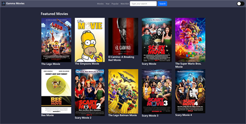

# <b><i>Project: Gamma-movies APP </b></i>

A movie category list that allows users to find movies and see their details and save the movies as watchlist or as watched and rating it themselves.

 

## Table of Contents

- [Description](#Description)
- [Introduction](#Introduction)
- [Features](#Features)
- [Technology](#Technology)
- [Getting-started](#Getting-started)
- [Usage](#Usage)
- [License](#License)
- [Credits](#Credits)
- [Team](#Team)

## Description
Gamma-movies is an APP where you can find movie reviews and more content about cinema...it is very intuitive and easy to use, Gamma-movies is an APP for every people with special attention to elderly, with a simple search you can find reviews, comments, posters and kind of movies information.

## Introduction

For this proyect we have decided to create an APP easy to use where you can find all about your favorite movies and recomendations to enjoy of new ones...search by title, year, cast... find a movie never was so easy with "Gamma-movies"

## Features
- Dynamic website which allows users to navigate easily.
- Watchlist button which allows users to save movies to their local storage and see what movies they have saved.
- Advanced movie filter which allows users to filter movies according to genre, age rating, and year.
- Search bar on navbar for easy searching.
- Dark/Light theme available.

## Technologies

## Getting started

## Usage

## License

This project is licensed under a MIT License.

## Credits
- <i>[Rotten Tomatoes](https://www.rottentomatoes.com/)
- <i>[IMDB](https://www.imdb.com/)
- <i>[OMDBAPI](https://www.omdbapi.com/)
- <i>[Catppuccin](https://catppuccin-website.vercel.app/)  (for theme)
- <i>[Bootstrp](https://getbootstrap.com/)

## Team

Gwyneth Bautista

Angel Castaneda

Memouna Irain

Anderson Gumede

## Repository   

https://github.com/lunar-potato/gamma-movies

## Deployed    

https://lunar-potato.github.io/gamma-movies
